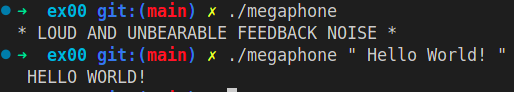
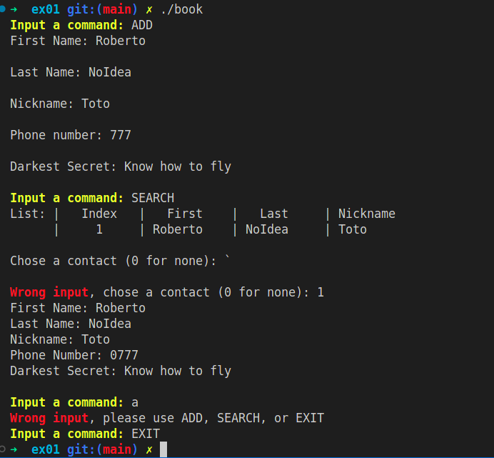

# CPP learning module 05 of 42 School

## Summary

[About the project](#about-the-project)

[Exercices](#exercices)

[Links](#links)

[Screenshots](#screenshots)

## About the Project

This project is the `CPP 06` learning module of 42 School.
All the C++ modules are based on C++98.

This project focuses on `Class`, `Namespaces`, `Member function`, `Static`, `Const` & basics.

## Exercices

### ex00

Create a `megaphone` using `std::cout` & `toupper()`. (Whatever you enter as parameter it uppercase it)

### ex01

Create `PhoneBook` & `Contact` class. Using `getline()` get inputs and execute commands.

There are 3 commands :

- `ADD` that can add contact to the phone book. When used, the user has to input first and last name & nickname, a phonenumber and also a darkest secret. All of these informtions are stored into a contact. Also there can only be 10 max contacts. If the user create more contacts, the actual contacts are destroyed and replaced in the order they appeared.

- `SEARCH` that print all the basics informations of the contacts stored in the phonebook. If the user want to know more someone, he has to input an id of the contact he want.

- `EXIT` to exit the program.

### ex02

I didn't do this exercice. Also, the code of this exercice on this git is not compilating.

## Links

You can find my other CPP modules here :
- [CPP_00](https://github.com/Kwro91/cpp00) Class, Namespaces, Member function, Static, Const & basics.

- [CPP_01](https://github.com/Kwro91/cpp01) Memory allocation, Pointer & Reference, Switch case.

- [CPP_02](https://github.com/Kwro91/cpp02) Polymorphism (overloading), Canonical form.

- [CPP_03](https://github.com/Kwro91/cpp03) Inheritance.

- [CPP_04](https://github.com/Kwro91/cpp04) Polymorphism (overriding), Derived class, Abstract class, Interface.

- [CPP_05](https://github.com/Kwro91/cpp05) : Try & catch, Exceptions.

- [CPP_06](https://github.com/Kwro91/cpp06) : Cast, Type conversion.

## Screenshots

